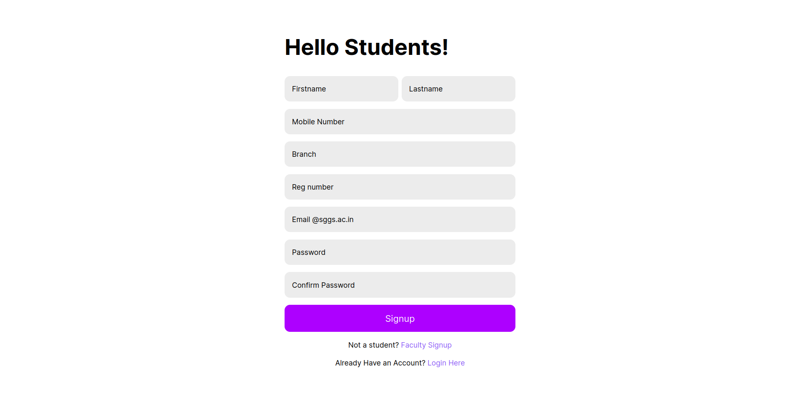
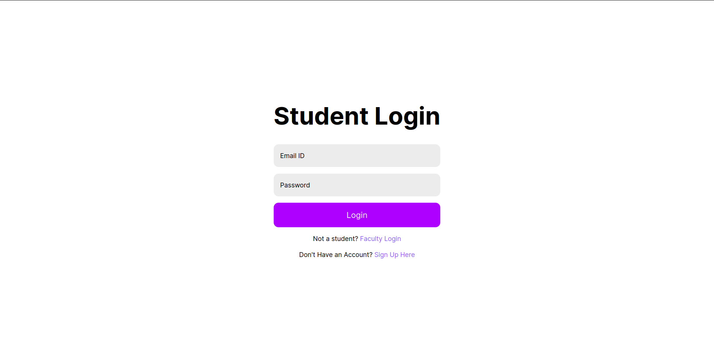
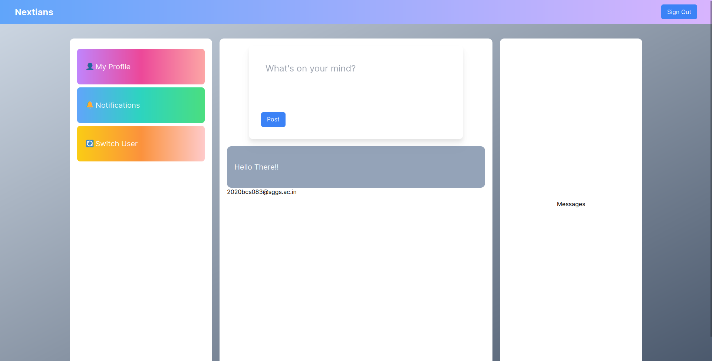
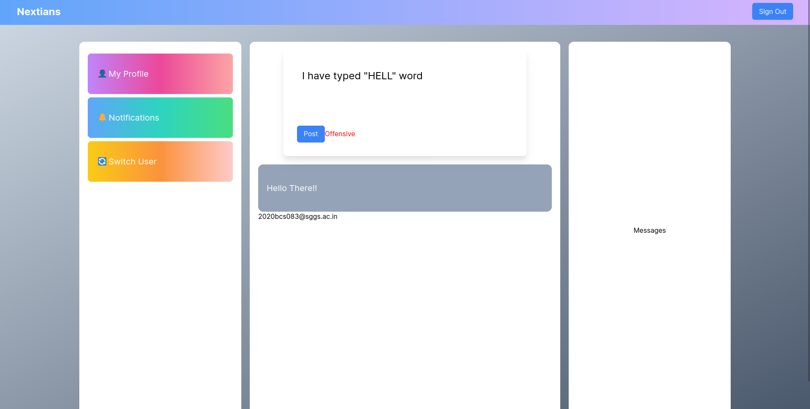

## HackFusion Hackathon

# Problem Statement
We were asked to build a social media Application for our college.

Features: 
    + User should be able to sign up as Faculty, Student, Admin.
    + There should be an option made available to the user to post content as anonymous.
    + Offensive context must be filter out.

# To get started

```console
npm run dev
```

# Sign Up Page
Start by creating a account (use only sggs.ac.in mail)


# Login Page
Login using your details


# Main Page


# Filter Out Offensive Content


